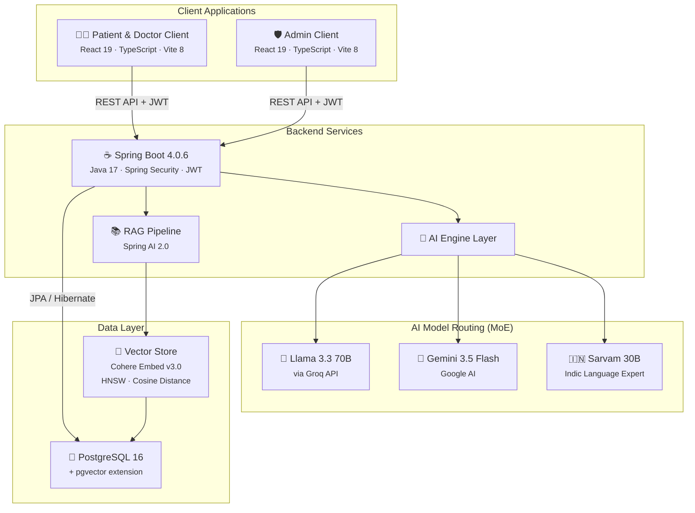
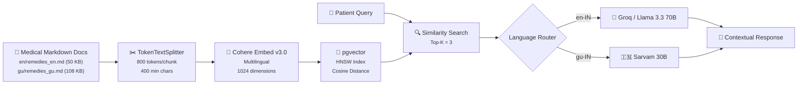

<p align="center">
  
  
  
  
  
  
  
  
</p>

<h1 align="center">🩺 Dhanvantari 2.0</h1>

<p align="center">
  <strong>AI-Powered Healthcare Ecosystem — Bridging Ancient Wisdom with Modern Technology</strong>
</p>

<p align="center">
  <em>Inspired by Lord Dhanvantari — the Hindu deity of medicine and Ayurveda — this platform delivers
  clinical-grade AI triage, empathetic mental health support, intelligent appointment scheduling,
  and administrative oversight in a multilingual, privacy-first architecture.</em>
</p>

---

## 📑 Table of Contents

- [Overview](#-overview)
- [Architecture](#-architecture)
- [Technology Stack](#-technology-stack)
- [Key Features](#-key-features)
  - [Patient Portal](#-patient-portal)
  - [Doctor Portal](#-doctor-portal)
  - [Admin Dashboard](#%EF%B8%8F-admin-dashboard)
- [AI & RAG Pipeline](#-ai--rag-pipeline)
- [Project Structure](#-project-structure)
- [Getting Started](#-getting-started)
  - [Prerequisites](#-prerequisites)
  - [Installation](#-step-by-step-installation)
- [API Reference](#-api-reference)
- [Security & Privacy](#-security--privacy)
- [Environment Variables](#-environment-variables)
- [Contributing](#-contributing)
- [License](#-license)

---

## 🌟 Overview

Dhanvantari 2.0 is an **enterprise-grade digital health ecosystem** built as a multi-module monorepo. It encompasses three independently deployable frontends and a unified Spring Boot backend, all powered by a **Mixture of Experts (MoE)** AI system that routes clinical queries to the optimal language model based on user locale and intent.

### What Makes Dhanvantari Unique?

| Capability | Description |
|---|---|
| **Mixture of Experts AI** | Automatically routes to Llama 3.3 70B (via Groq), Gemini 3.5 Flash, or Sarvam 30B based on language and task |
| **RAG-Powered Triage** | Medical knowledge base vectorized via Cohere Embed Multilingual v3.0 and stored in pgvector for semantic similarity search |
| **Ephemeral Mental Health** | Zero-persistence architecture for mental health chats — nothing is ever saved to disk or database |
| **Multilingual Native** | Full English and Gujarati support across all AI models, UI, and RAG documents with native-script responses |
| **Graceful Doctor Offboarding** | SUNSETTING lifecycle state allows doctors to fulfill existing appointments before account deletion |

---

## 🏗️ Architecture



### Request Flow

1. **Client** sends an authenticated REST request with a JWT bearer token
2. **Spring Security** validates the token and enforces role-based access (`PATIENT`, `DOCTOR`, `ADMIN`)
3. **Controller** delegates to the appropriate service layer
4. For AI requests, the **MoE Router** selects the optimal model based on:
   - `ai.active.engine` property (`gemini` or `llama`) for triage
   - Language code (`en-IN` → Groq/Llama, `gu-IN` → Sarvam 30B) for RAG
5. **RAG Service** performs pgvector similarity search, injects context, and generates grounded responses
6. Responses flow back through the controller to the client

---

## 🔧 Technology Stack

### Frontend (Patient/Doctor Client)

| Technology | Version | Purpose |
|---|---|---|
| React | 19.2 | UI component library |
| TypeScript | 6.0 | Type-safe development |
| Vite | 8.0 | Lightning-fast build tooling |
| Tailwind CSS | 3.4 | Utility-first styling |
| Framer Motion | 12.x | Smooth animations & transitions |
| React Router DOM | 7.x | Client-side routing |
| i18next | 26.x | Internationalization (English & Gujarati) |
| Leaflet / React-Leaflet | 1.9 / 5.0 | Interactive geo-mapping for clinic locations |
| Lucide React | 1.x | Icon library |
| Axios | 1.18 | HTTP client |

### Frontend (Admin Client)

| Technology | Version | Purpose |
|---|---|---|
| React | 19.2 | UI component library |
| TypeScript | 6.0 | Type-safe development |
| Vite | 8.0 | Build tooling |
| Tailwind CSS | 4.3 | Utility-first styling (v4) |
| Framer Motion | 12.x | Animations |
| React Router DOM | 7.x | Routing with protected routes |
| Axios | 1.17 | HTTP client |

### Backend

| Technology | Version | Purpose |
|---|---|---|
| Spring Boot | 4.0.6 | Application framework |
| Java | 17+ | Runtime |
| Spring Security | — | Authentication & authorization |
| Spring Data JPA | — | ORM & database access |
| Spring AI | 2.0.0 | AI/ML integration framework |
| Hibernate | — | Entity mapping & migrations |
| JJWT | 0.11.5 | JWT token generation & validation |
| Jackson | — | JSON serialization |
| Lombok | 1.18.46 | Boilerplate reduction |
| PostgreSQL Driver | — | Database connectivity |
| Maven | — | Build & dependency management |

### AI & ML Infrastructure

| Service | Model | Purpose |
|---|---|---|
| **Groq API** | Llama 3.3 70B Versatile | Primary triage engine, mental health support, English RAG |
| **Google AI** | Gemini 3.5 Flash | Alternate triage engine (switchable) |
| **Sarvam AI** | Sarvam 30B | Native Gujarati RAG responses |
| **Cohere** | Embed Multilingual v3.0 | Bilingual document embedding (1024 dimensions) |
| **pgvector** | HNSW Index | Vector similarity search with cosine distance |

### Infrastructure

| Technology | Purpose |
|---|---|
| Docker Compose | Container orchestration for PostgreSQL + pgvector |
| pgvector (pg16) | Vector-extended PostgreSQL image |

---

## 🌟 Key Features

### 👤 Patient Portal

#### 🤖 AI Symptom Triage (RAG-Powered)
- Describe symptoms in **natural language** in English or Gujarati
- RAG pipeline retrieves relevant medical knowledge from a curated bilingual corpus (~158 KB of medical documents)
- Context-aware responses include Indian home remedies (Gharelu Upchar) with Ayurvedic ingredients
- Full **chat session persistence** — review past triage conversations at any time
- Safety-first: always recommends consulting a real doctor for serious symptoms

#### 💚 Empathetic Mental Health Support
- 24/7 AI companion named **"Serene"** using a trauma-informed, elevation-focused therapy model
- Supports **8 Indian languages**: English, Hindi, Gujarati, Marathi, Bengali, Telugu, Tamil, and Urdu
- **Ephemeral by design** — absolutely zero data is persisted to any database; chat exists only in browser memory
- Pre-session **mood assessment** with emoji selection (😊 😐 😔 😢 😡)
- Post-session mood capture to track emotional shift
- **Glassmorphic Mood Calendar** — visual mood history with before/after mood tracking

#### 📅 Smart Appointment Booking
- Filter practitioners by **State → City → Specialization** with cascading dropdowns
- Browse doctor cards with experience years, degrees, clinic addresses, and registration numbers
- **Interactive map integration** (Leaflet) — view clinic locations on an embedded map
- Query **real-time available time slots** per doctor per date
- Symptom-aware booking — specify primary complaint, duration, and intensity (mild/moderate/severe)
- Track upcoming and completed appointments with doctor's notes and prescriptions

#### 🌐 Full Internationalization
- Dynamic toggle between **English** (`en-IN`) and **Gujarati** (`gu-IN`)
- Covers all UI elements: navigation, forms, chat greetings, feature descriptions, and error messages
- AI responses honor the selected language natively (not translated — generated in-language)

#### 👤 Profile Management
- View and edit personal details: name, date of birth, gender, blood group, height, weight
- Manage pre-existing medical conditions (stored as comma-separated tags)
- Account self-deletion support

---

### 🩺 Doctor Portal

#### 📋 Consultation Scheduler
- Interactive appointment list with date-based filtering
- Full patient profile visibility: age, gender, blood group, height, weight, complaint history, pre-existing conditions

#### 📖 Integrated Triage History
- Read the **exact AI triage chat logs** between the patient and Dhanvantari before the consultation
- View session titles, language codes, and chronological message threads

#### 💊 Clinical Prescription Tool
- Write and issue **diagnoses, prescriptions, and follow-up precautions** directly into the patient's appointment record
- Completing a prescription automatically transitions the appointment status to `COMPLETED`

#### 🌅 Graceful Offboarding (Sunsetting)
- Requesting account deletion transitions the doctor to `SUNSETTING` state
- New patient bookings are blocked, but the doctor retains login access
- Allows fulfilling all pre-existing appointments before the Admin performs final account removal

---

### 🛡️ Admin Dashboard

#### ✅ Practitioner Approval Workflow
- Review pending doctor registration applications
- Verify medical registration numbers, degrees, specializations, and geographic coordinates
- **Approve** → transitions doctor to `ACTIVE` status
- **Reject** → permanently deletes the application and associated user record

#### 📊 Roster Audit & Management
- View the complete medical directory with status filters (`PENDING_APPROVAL`, `ACTIVE`, `SUNSETTING`)
- Manage practitioner lifecycle transitions

#### 🔒 Safety Interlock Deletion System
- Prevents deletion of active practitioners who still have **upcoming appointments**
- Displays the count and details of pending appointments
- Requires explicit typing of `CONFIRM` to bypass the safety interlock

#### 🔐 Protected Access
- Admin routes are guarded by both client-side `ProtectedRoute` checks and server-side `@PreAuthorize("hasRole('ADMIN')")` enforcement

---

## 🧠 AI & RAG Pipeline

### Mixture of Experts (MoE) Architecture

The system implements a **strategy pattern** for AI model selection:

```
ai.active.engine=llama    →  LlamaTriageEngine  (Groq / Llama 3.3 70B)
ai.active.engine=gemini   →  GeminiTriageEngine (Google Gemini 3.5 Flash)
```

Both engines implement the `AiTriageEngine` interface, activated via `@ConditionalOnProperty`, enabling **zero-downtime model switching** by changing a single config property.

### RAG Pipeline Detail



### Prompt Engineering

Each AI interaction uses carefully crafted system prompts that enforce:

- **Native language generation** (not translation) with 11 language-specific instructions
- **Empathy-first** communication ("Validate → Comfort → Guide" framework)
- **Context-aware safety** — remedies are filtered against patient medical history
- **Structured formatting** — bullet points, bold remedies, line breaks for readability
- **Temperature control** — 0.4 for triage (factual), 0.1 for RAG (precision), default for support

---

## 📂 Project Structure

```
2.0_Dhanvantari/
├── frontend/                          # Patient & Doctor Client (Vite + React 19)
│   ├── src/
│   │   ├── components/
│   │   │   ├── AuthModal.tsx          # Registration & login modal (Patient/Doctor)
│   │   │   ├── CustomCursor.tsx       # Custom animated cursor
│   │   │   ├── CustomDatePicker.tsx   # Glassmorphic date picker
│   │   │   ├── CustomDropdown.tsx     # Reusable dropdown component
│   │   │   ├── Features.tsx           # Landing page feature cards
│   │   │   ├── HeartPulseMonitor.tsx  # Animated heart pulse visualization
│   │   │   ├── Hero.tsx              # Landing page hero section
│   │   │   ├── MapModal.tsx          # Leaflet map integration
│   │   │   ├── Navbar.tsx            # Navigation bar with language toggle
│   │   │   ├── SearchableSelect.tsx  # Filterable dropdown component
│   │   │   └── profile/
│   │   │       ├── Profile.tsx        # Profile container
│   │   │       ├── PatientProfileCard.tsx
│   │   │       ├── DoctorProfileCard.tsx
│   │   │       └── EditProfile.tsx    # Profile editing form
│   │   ├── context/
│   │   │   └── LanguageContext.tsx     # i18n language state provider
│   │   ├── pages/
│   │   │   ├── Home.tsx              # Landing page
│   │   │   ├── Login.tsx             # Login page
│   │   │   ├── PatientDashboard.tsx  # Full patient dashboard (77 KB)
│   │   │   └── DoctorDashboard.tsx   # Full doctor dashboard (40 KB)
│   │   ├── services/
│   │   │   ├── api.ts                # REST API client
│   │   │   └── authService.ts        # Auth token management
│   │   └── i18n.ts                   # English & Gujarati translations
│   └── package.json
│
├── admin-frontend/                    # Admin Dashboard (Vite + React 19)
│   ├── src/
│   │   ├── pages/
│   │   │   ├── AdminLogin.tsx         # Admin authentication
│   │   │   └── AdminDashboard.tsx     # Approval & management console (37 KB)
│   │   └── services/
│   │       └── api.ts                 # Admin API client
│   └── package.json
│
├── backend/                           # Spring Boot Backend (Java 17)
│   ├── src/main/java/com/dhanvantari/backend/
│   │   ├── config/
│   │   │   ├── AdminSeeder.java       # Auto-seeds default admin account
│   │   │   ├── AppConfig.java         # Application configuration
│   │   │   └── DatabaseInitializer.java # Constraint management on startup
│   │   ├── controller/
│   │   │   ├── AuthController.java    # /api/auth/** — Login & registration
│   │   │   ├── UserController.java    # /api/*/me — Profile CRUD
│   │   │   ├── AiChatController.java  # /api/patient/chat/** — All AI features
│   │   │   ├── AppointmentController.java  # /api/patient/appointments/**
│   │   │   ├── DoctorAppointmentController.java # /api/doctor/**
│   │   │   ├── DoctorController.java  # Public doctor listing
│   │   │   ├── AdminController.java   # /api/admin/** — Practitioner mgmt
│   │   │   ├── LocationController.java # /api/locations/** — State/City data
│   │   │   ├── RagController.java     # /api/*/rag — Document ingestion
│   │   │   └── AIOperationsController.java # AI operations endpoint
│   │   ├── dto/                       # Data Transfer Objects
│   │   ├── entity/                    # JPA Entities (14 total)
│   │   │   ├── User.java             # Base user (UUID, email, role)
│   │   │   ├── Patient.java          # Patient profile (DOB, blood group, etc.)
│   │   │   ├── Doctor.java           # Doctor profile (geo, license, status)
│   │   │   ├── Appointment.java      # Scheduling with optimistic locking
│   │   │   ├── ChatSession.java      # Triage chat session container
│   │   │   ├── ChatMessage.java      # Individual chat messages
│   │   │   ├── MoodRecord.java       # Mood shift tracking
│   │   │   ├── State.java / City.java / Specialization.java  # Location data
│   │   │   └── AccountStatus.java    # PENDING → ACTIVE → SUNSETTING → DELETED
│   │   ├── repository/               # Spring Data JPA Repositories (10 total)
│   │   ├── security/
│   │   │   ├── SecurityConfig.java    # CORS, CSRF, JWT filter chain
│   │   │   ├── JwtAuthenticationFilter.java  # Per-request JWT validation
│   │   │   ├── JwtUtil.java          # Token generation & parsing
│   │   │   └── CustomUserDetailsService.java
│   │   ├── service/
│   │   │   ├── AuthService.java       # Registration, login, profile CRUD
│   │   │   ├── ChatService.java       # Chat session & message persistence
│   │   │   ├── RagService.java        # RAG orchestration (MoE routing)
│   │   │   ├── GeminiTriageEngine.java    # Gemini AI adapter
│   │   │   ├── LlamaTriageEngine.java     # Llama/Groq AI adapter
│   │   │   ├── AiMentalHealthEngine.java  # Mental health AI (Serene)
│   │   │   ├── HuggingFaceLlamaService.java # Low-level Groq API client
│   │   │   ├── SarvamChatService.java     # Sarvam 30B Gujarati client
│   │   │   ├── DocumentIngestionService.java  # RAG doc chunking & embedding
│   │   │   └── impl/                 # Service implementations
│   │   └── exception/
│   │       └── GlobalExceptionHandler.java # Unified error responses
│   ├── src/main/resources/
│   │   ├── application.properties     # All configuration & API keys
│   │   └── rag-data/                  # Medical knowledge base
│   │       ├── en/remedies_en.md      # English remedies (50 KB)
│   │       └── gu/remedies_gu.md      # Gujarati remedies (108 KB)
│   └── pom.xml
│
├── docker-compose.yml                 # pgvector database container
├── package.json                       # Workspace-level dependencies
└── .github/                           # CI/CD workflows
```

---

## 🚀 Getting Started

### 📋 Prerequisites

Ensure the following are installed on your system:

| Requirement | Minimum Version | Download |
|---|---|---|
| **Node.js** | v18+ | [nodejs.org](https://nodejs.org/) |
| **Java (JDK)** | 17+ | [Oracle JDK](https://www.oracle.com/java/technologies/downloads/) or [Eclipse Temurin](https://adoptium.net/) |
| **Docker Desktop** | Latest | [docker.com](https://www.docker.com/products/docker-desktop/) |
| **Maven** | 3.8+ | Included via `mvnw` wrapper |

---

### 💻 Step-by-Step Installation

#### Step 1: Clone the Repository

```bash
git clone https://github.com/kunj2006-msu/Dhanvantari2.0.git
cd Dhanvantari2.0
```

#### Step 2: Start the PostgreSQL + pgvector Database

```bash
docker compose up -d
```

> This spins up a PostgreSQL 16 container with the pgvector extension on **port 5432**.
> - **Database:** `dhanvantari`
> - **Username:** `postgres`
> - **Password:** `kunj`

#### Step 3: Configure & Launch the Backend

```bash
cd backend

# On Windows (PowerShell)
.\mvnw.cmd spring-boot:run

# On Linux / macOS
./mvnw spring-boot:run
```

> The backend bootstraps on **`http://localhost:8080`** and automatically:
> - Creates all database tables via Hibernate DDL auto-update
> - Seeds the default admin account
> - Initializes database constraints

#### Step 4: Run the Patient/Doctor Frontend

```bash
cd frontend
npm install
npm run dev
```

> Available at **`http://localhost:5173`**

#### Step 5: Run the Admin Dashboard

```bash
cd admin-frontend
npm install
npm run dev
```

> Available at **`http://localhost:5174`** (or next available port)

#### Step 6: Ingest RAG Knowledge Base (One-Time)

After the backend is running, trigger the medical document ingestion:

```bash
# POST to the RAG ingestion endpoint (requires admin or patient auth)
curl -X POST http://localhost:8080/api/patient/rag/ingest \
  -H "Authorization: Bearer <your-jwt-token>"
```

> This reads all `.md` files from `rag-data/`, chunks them with `TokenTextSplitter`, embeds them via Cohere, and stores vectors in pgvector.

---

## 📡 API Reference

### Authentication (`/api/auth`)

| Method | Endpoint | Description | Auth |
|---|---|---|---|
| `POST` | `/api/auth/register` | Register a new patient or doctor | Public |
| `POST` | `/api/auth/login` | Authenticate and receive JWT token | Public |

### Patient Endpoints (`/api/patient`)

| Method | Endpoint | Description | Auth |
|---|---|---|---|
| `GET` | `/api/patient/me` | Get current patient profile | `PATIENT` |
| `PUT` | `/api/patient/me` | Update patient profile | `PATIENT` |
| `DELETE` | `/api/patient/me` | Delete patient account | `PATIENT` |
| `POST` | `/api/patient/chat/triage` | AI symptom triage (RAG) | `PATIENT` |
| `POST` | `/api/patient/chat/mental-health/chat` | Ephemeral mental health chat | `PATIENT` |
| `POST` | `/api/patient/chat/mental-health/mood` | Save mood shift record | `PATIENT` |
| `GET` | `/api/patient/chat/mental-health/mood` | Get mood history | `PATIENT` |
| `GET` | `/api/patient/chat/sessions` | List triage chat sessions | `PATIENT` |
| `GET` | `/api/patient/chat/sessions/:id/messages` | Get session messages | `PATIENT` |
| `DELETE` | `/api/patient/chat/sessions/:id` | Delete a chat session | `PATIENT` |
| `GET` | `/api/patient/appointments` | List patient appointments | `PATIENT` |
| `POST` | `/api/patient/appointments` | Book new appointment | `PATIENT` |

### Doctor Endpoints (`/api/doctor`)

| Method | Endpoint | Description | Auth |
|---|---|---|---|
| `GET` | `/api/doctor/me` | Get current doctor profile | `DOCTOR` |
| `PUT` | `/api/doctor/me` | Update doctor profile | `DOCTOR` |
| `DELETE` | `/api/doctor/me` | Request account sunsetting | `DOCTOR` |
| `GET` | `/api/doctor/appointments` | List upcoming appointments | `DOCTOR` |
| `PUT` | `/api/doctor/appointments/:id/notes` | Submit prescription & mark complete | `DOCTOR` |
| `GET` | `/api/doctor/patients/:id/triage-history` | View patient's AI triage logs | `DOCTOR` |

### Admin Endpoints (`/api/admin`)

| Method | Endpoint | Description | Auth |
|---|---|---|---|
| `GET` | `/api/admin/doctors` | List all doctors (all statuses) | `ADMIN` |
| `PUT` | `/api/admin/doctors/:id/status` | Approve / change doctor status | `ADMIN` |
| `DELETE` | `/api/admin/doctors/:id/reject` | Reject & delete doctor application | `ADMIN` |
| `GET` | `/api/admin/doctors/:id/appointments/upcoming` | Check pending appointments | `ADMIN` |

### Public Endpoints

| Method | Endpoint | Description |
|---|---|---|
| `GET` | `/api/locations/states` | List all states |
| `GET` | `/api/locations/states/:id/cities` | List cities in a state |
| `GET` | `/api/locations/specializations` | List all specializations |

---

## 🔒 Security & Privacy

### Authentication & Authorization
- **JWT-based stateless authentication** — no server-side sessions
- **BCrypt password hashing** with Spring Security
- **Role-based access control** at three levels:
  - URL pattern matching in `SecurityFilterChain`
  - Method-level `@PreAuthorize` annotations
  - Client-side route protection with `ProtectedRoute` components
- **CORS whitelist** restricted to `localhost:5173`, `localhost:5174`, `localhost:3000`

### Mental Health Privacy Guarantee
- Mental health chat uses **ephemeral session architecture**
- The full conversation history lives exclusively in the browser's React state
- The backend receives only the current conversation context for AI processing
- **No chat transcripts are written to any database, log file, or persistent storage**
- When the user leaves the session, all data is purged from browser memory

### Data Protection
- Appointment records use **optimistic locking** (`@Version`) to prevent concurrent modification
- Doctor deletion is protected by a **safety interlock** that checks for upcoming appointments
- Database constraints are managed via startup initializers for safe schema evolution

---

## ⚙️ Environment Variables

All configuration is managed in `backend/src/main/resources/application.properties`:

| Property | Description |
|---|---|
| `ai.active.engine` | AI engine selector: `llama` (Groq) or `gemini` (Google) |
| `huggingface.api.key` | Groq API key for Llama 3.3 70B |
| `gemini.api.key` | Google Gemini API key |
| `sarvam.api.key` | Sarvam AI key for Gujarati responses |
| `spring.ai.openai.chat.base-url` | Groq-compatible OpenAI endpoint |
| `spring.ai.openai.embedding.base-url` | Cohere embedding endpoint |
| `spring.datasource.url` | PostgreSQL connection string |
| `spring.ai.vectorstore.pgvector.dimensions` | Embedding vector size (1024) |

> ⚠️ **Important:** Before deploying to production, rotate all API keys and move them to environment variables or a secrets manager. The keys committed in the repository are for development use only.

---

## 🤝 Contributing

Contributions are welcome! Please follow these steps:

1. **Fork** the repository
2. **Create** a feature branch (`git checkout -b feature/amazing-feature`)
3. **Commit** your changes (`git commit -m 'Add amazing feature'`)
4. **Push** to the branch (`git push origin feature/amazing-feature`)
5. **Open** a Pull Request

### Development Guidelines
- Follow the existing code style and naming conventions
- Add appropriate error handling and logging
- Write meaningful commit messages
- Test your changes against all three frontends before submitting

---

## 📄 License

This project is licensed under the MIT License — see the [LICENSE](LICENSE) file for details.

---

<p align="center">
  <strong>Built with 💚 by the Dhanvantari Team</strong><br/>
  <em>Bridging ancient Ayurvedic wisdom with modern AI for a healthier tomorrow.</em>
</p>
